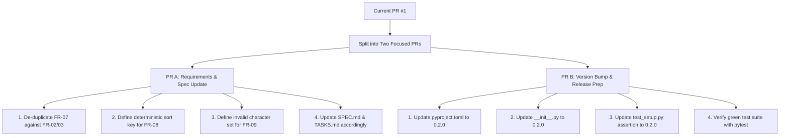

# Code Review & Quality Report: PR #1

**Target Repository:** `AlexSvS/ada-05-spec-driven-feature`  
**Pull Request:** PR #1 ("New requirements added")  
**Branches:** `update-branch` (head: `f4b58c4`) → `master` (base: `bd050c2`)  
**Review Standard:** `code-review-and-quality` (Five-Axis Quality Review)  
**Date:** 2026-10-04  

---

## 1. Executive Summary & Verdict

### The Approval Standard
> *Approve a change when it definitely improves overall code health, even if it isn't perfect. Perfect code doesn't exist — the goal is continuous improvement.*

### Review Verdict
**REQUEST CHANGES (BLOCKED)**

PR #1 does **not** improve overall code health. Instead, it introduces an immediate test failure into the repository, commits redundant and underspecified requirements, entangles unrelated test modifications into a documentation pull request, and desynchronizes the repository's specification-driven development lifecycle.

```
┌────────────────────────────────────────────────────────────────────────┐
│                        QUALITY GATE BREAKDOWN                          │
├───────────────────────┬──────────┬─────────────────────────────────────┤
│ Dimension             │ Status   │ Key Risk                            │
├───────────────────────┼──────────┼─────────────────────────────────────┤
│ 1. Correctness        │ FAILED   │ Breaking test regression in suite   │
│ 2. Readability        │ FAILED   │ Redundant & ambiguous requirements  │
│ 3. Architecture       │ FAILED   │ Spec-driven lifecycle desync        │
│ 4. Security           │ CONCERN  │ Undefined input validation boundary │
│ 5. Performance        │ NEUTRAL  │ Future sorting impact unassessed    │
└───────────────────────┴──────────┴─────────────────────────────────────┘
```

---

## 2. Review Context & PR Sizing

### Context
PR #1 was opened with the title *"New requirements added"* and description *"Added three new requirements to REQUIREMENTS.md."*  
The repository adheres to **Specification-Driven Development** (defined in `AGENTS.md`, `ARQUITECTURE.md`, `REQUIREMENTS.md`, `SPEC.md`, `TASKS.md`, and tracked via `docs/traceability.md`).

### Change Sizing Assessment
- **Lines changed:** 5 additions, 1 deletion (6 lines total) across 2 files.
- **Diff footprint:** Well below the ~100 line target for single sittings.
- **Cohesion assessment:** **Failed**. Despite its minimal diff size, the change violates the *one change* principle. It couples a requirements specification update with an unrelated version-assertion alteration in the automated test suite.

### Commits Inspected
1. `66ed604` — *"New requirements added"* (touches `REQUIREMENTS.md`)
2. `f4b58c4` — *"Introduce version validation test change"* (touches `tests/test_setup.py`)

---

## 3. Step-by-Step Five-Axis Evaluation

### Axis 1: Correctness (Tests First)
- **Automated Test Run (`pytest` on `update-branch`):**
  - Result: **1 FAILED**, 40 passed.
  - Failing test: `tests/test_setup.py::test_package_import`
  - Trace: `AssertionError: assert '0.1.0' == '0.2.0'`.
  - Cause: Commit `f4b58c4` bumped the asserted version in `tests/test_setup.py` from `"0.1.0"` to `"0.2.0"`, but `src/customer_search/__init__.py` and `pyproject.toml` remain pinned at `"0.1.0"`.
- **Missing Verification for New Rules:**
  - FR-07, FR-08, and FR-09 have zero test cases across the entire test suite (`tests/test_service.py`, `tests/test_cli.py`, `tests/test_storage.py`).

### Axis 2: Readability & Simplicity
- **FR-07 Redundancy:** States *"The system shall return customers whose name or email contains the search query as a substring."* This directly duplicates `FR-02` (name substring matching) and `FR-03` (email substring matching), creating confusion about whether a new search capability is introduced.
- **FR-08 Ambiguity & Contradiction:** Mandates *"consistent and deterministic order"* without specifying any ordering key (ID ascending? name alphabetical? JSON file order?). This conflicts directly with unresolved open question `Q-02` in `REQUIREMENTS.md`.
- **FR-09 Underspecification:** Requires an error message when queries contain *"invalid characters or an invalid input format"*, but completely omits what characters or patterns are invalid.

### Axis 3: Architecture & Lifecycle Consistency
- **Lifecycle Desynchronization:**
  - `SPEC.md` was not updated and only covers `FR-01` through `FR-06`.
  - `TASKS.md` has no implementation or verification tasks planned for the new requirements.
  - `docs/traceability.md` has no mapping for the new requirements.
  - `src/customer_search/` lacks implementation for FR-08 (sorting) and FR-09 (invalid character validation).
- **Scope Entanglement:** A PR titled *"New requirements added"* should not bundle code/test edits that break test assertions.

### Axis 4: Security
- **Threat Model for FR-09:** The application is an offline, local CLI performing in-memory substring matching against JSON data. There is no SQL database or shell execution susceptible to injection.
- **Over-sanitization Risk:** Introducing unguided character validation risks rejecting legitimate international customer names (e.g., accents, hyphens, apostrophes like *O'Connor* or *Jean-Luc*) and valid email characters (`+`, `.`, `-`, `_`).

### Axis 5: Performance
- **Deterministic Ordering Overhead:** If FR-08 intends sorting (e.g., $O(N \log N)$), `CustomerService.search()` must be evaluated against `NFR-01` (<1.0s execution benchmark for up to 100 customer records). For 100 records, in-memory sorting easily satisfies NFR-01, but the sorting strategy must be made explicit.

---

## 4. Categorized Review Findings

Findings are ordered by leverage: **Critical** (blocking functionality/tests), **Required** (architectural/specification defects), **Consider** (security/design), and **Nit/FYI** (hygiene).

### [Critical] Finding 01: Breaking Test Regression in Test Suite
- **Severity:** `Critical:` (Blocks Merge)
- **File / Evidence:** `tests/test_setup.py:18` (Commit `f4b58c4`)
  ```python
  def test_package_import():
      import customer_search
      assert hasattr(customer_search, "__version__")
  -   assert customer_search.__version__ == "0.1.0"
  +   assert customer_search.__version__ == "0.2.0"
  ```
  `src/customer_search/__init__.py:3`:
  ```python
  __version__ = "0.1.0"
  ```
  `pyproject.toml:7`:
  ```toml
  version = "0.1.0"
  ```
- **Engineering Rationale:**
  A pull request must never introduce failing tests into the main branch. Commit `f4b58c4` modified the test expectation without updating the source package version, immediately breaking `pytest` with `AssertionError: assert '0.1.0' == '0.2.0'`. This violates `AGENTS.md` ("Relevant tests pass") and general CI stability.
- **Recommended Action:**
  - **If no release bump is intended in this PR:** Revert the assertion change in `tests/test_setup.py` back to `"0.1.0"`.
  - **If a release bump to 0.2.0 is intended:** Atomically synchronize all version declarations: update `__version__ = "0.2.0"` in `src/customer_search/__init__.py`, `version = "0.2.0"` in `pyproject.toml`, and update package metadata.

---

### [Required] Finding 02: Broken Spec-Driven Development Lifecycle & Untracked Requirements
- **Severity:** Required (Must address before merge)
- **File / Evidence:**
  - `REQUIREMENTS.md:15-17` (Commit `66ed604`)
  - `SPEC.md:7-20`
  - `TASKS.md:1-40`
  - `docs/traceability.md:3-16`
  - `src/customer_search/service.py`
  - `tests/`
- **Engineering Rationale:**
  The repository operates strictly under Specification-Driven Development:
  1. Requirements added to `REQUIREMENTS.md` must be mapped into `SPEC.md` with explicit Domain Rules, Validation Rules (VR), Error Handling (EH), and Acceptance Criteria (AC).
  2. Tasks must be decomposed in `TASKS.md`.
  3. Acceptance tests must be written to cover the criteria.
  4. Changes must be verified and tracked in `docs/traceability.md`.
  
  PR #1 adds FR-07, FR-08, and FR-09 to `REQUIREMENTS.md` in isolation, leaving the specification, tasks, implementation, and test suites completely desynchronized.
- **Recommended Action:**
  Either:
  1. Treat PR #1 strictly as a requirements discussion / RFC PR (document-only), clearly stating in the PR description that implementation will follow in subsequent task-driven branches, and remove the code/test commit `f4b58c4`.
  2. Or complete the development loop: update `SPEC.md`, add tasks in `TASKS.md`, implement sorting and validation in `src/customer_search/service.py`, add corresponding unit tests in `tests/test_service.py` and `tests/test_cli.py`, and update `docs/traceability.md`.

---

### [Required] Finding 03: Underspecified, Ambiguous, and Redundant Requirements
- **Severity:** Required (Must address before merge)
- **File / Evidence:** `REQUIREMENTS.md:15-17`
  ```markdown
  FR-07: The system shall return customers whose name or email contains the search query as a substring.
  FR-08: The system shall display matching customer records in a consistent and deterministic order.
  FR-09: The system shall return an appropriate error message when the provided search query contains invalid characters or an invalid input format.
  ```
- **Engineering Rationale:**
  - **FR-07 is redundant:** `FR-02` already specifies name substring matching, and `FR-03` specifies email substring matching. `src/customer_search/service.py` (lines 40-45) already implements this exact union via `SR-03`. Re-adding it as FR-07 creates ambiguity as to whether behavior should change.
  - **FR-08 conflicts with unresolved questions:** Line 23 of `REQUIREMENTS.md` contains Open Question `Q-02`: *"How should results be ordered (e.g., alphabetical by name, ID, or match relevance)..."*. Adding FR-08 without defining the order key leaves the requirement unfalsifiable and impossible to verify with automated tests.
  - **FR-09 lacks criteria:** What constitutes an "invalid character" or "invalid input format"? Without a whitelist or regex boundary, developers and reviewers cannot agree on what constitutes a bug versus expected behavior.
- **Recommended Action:**
  - **FR-07:** Remove `FR-07` or clarify that it is an explicit synthesis of FR-02 and FR-03 into a single unified search rule.
  - **FR-08:** Resolve `Q-02` by specifying the deterministic sort criteria (e.g., *"The system shall display matching customer records sorted ascending by customer ID"* or *"alphabetically by customer name"*).
  - **FR-09:** Specify the exact character constraints and format rules (e.g., *"The search query must contain only alphanumeric characters, spaces, and standard punctuation [a-zA-Z0-9 .'-]"*).

---

### [Required] Finding 04: PR Scope Mixing and Change Description Anti-Pattern
- **Severity:** Required (Must address before merge)
- **File / Evidence:**
  - PR Metadata: Title *"New requirements added"*, Body *"Added three new requirements to REQUIREMENTS.md."*
  - Commit `f4b58c4`: *"Introduce version validation test change"*
- **Engineering Rationale:**
  The PR violates two core principles of change management:
  1. **One change per PR:** Requirements documentation changes and package version test changes are two unrelated concerns.
  2. **Accurate change descriptions:** The PR title and description completely hide the fact that a test file was modified. An engineer glancing at the PR summary would believe this is a markdown-only change, missing the breaking test modification.
- **Recommended Action:**
  Drop commit `f4b58c4` from this PR so that the PR remains strictly focused on requirements. If a version bump is needed, submit it as a standalone, atomic PR titled *"Bump package version to 0.2.0"*.

---

### [Consider] Finding 05: Clarify Input Sanitization Threat Model & International Character Support
- **Severity:** Consider: (Design Suggestion)
- **File / Evidence:** `REQUIREMENTS.md:17` (FR-09), `src/customer_search/service.py:27-28`
- **Engineering Rationale:**
  Since the customer search operates locally on in-memory string objects, there is no risk of SQL injection or remote code execution. Overly aggressive input filtering could inadvertently block valid customer queries containing Unicode characters, accents (e.g., *Renée*, *Müller*), or punctuation common in email handles (`+`, `-`, `.`).
- **Recommended Action:**
  When drafting the specification for FR-09 in `SPEC.md`, ensure that the validation rule accommodates full UTF-8 Unicode characters and email punctuation, rejecting only null bytes or non-printable control characters if defense-in-depth is desired.

---

### [Nit] Finding 06: Remove Tracked Bytecode and Cache Artifacts from Repository
- **Severity:** Nit: (Informational / Hygiene)
- **File / Evidence:** `src/customer_search/__pycache__/`, `tests/__pycache__/`, `src/customer_search.egg-info/`
- **Engineering Rationale:**
  Compiled bytecode directories (`__pycache__`) and build metadata directories are tracked in git on both `master` and `update-branch`. These are build artifacts that create unnecessary git noise and can cause caching issues across different developer environments.
- **Recommended Action:**
  In a separate repository maintenance PR, remove `__pycache__` and `*.egg-info` from tracking and add them to `.gitignore`.

---

## 5. Structural Remedies & Proposed Moves

To unblock this change, the author should apply the following restructuring:



1. **Remedy A — Separate Concerns:**
   Remove commit `f4b58c4` from PR #1. Keep PR #1 strictly scoped to requirements refinement.
2. **Remedy B — Clarify Requirements:**
   Refine `REQUIREMENTS.md` to resolve ambiguities before declaring them final:
   - Clarify or remove FR-07.
   - Define the sorting rule for FR-08 (e.g. `order by customer.id ASC`).
   - Define the allowed character set for FR-09.
3. **Remedy C — Synchronize Version Bump (Standalone):**
   If releasing `0.2.0`, create a dedicated branch that updates `pyproject.toml`, `src/customer_search/__init__.py`, and `tests/test_setup.py` simultaneously so all tests remain green.

---

## 6. Verification Story (Step 5)

| Verification Item | Status | Details |
|---|---|---|
| **Automated Test Suite** | **FAILED** | `python -m pytest` failed (1 failed, 40 passed). `test_package_import` failed due to version mismatch. |
| **CI / Check Runs** | **None** | GitHub Actions / Check runs are not configured on the repo. |
| **Manual Verification** | **N/A** | No implementation changes were provided for the new requirements. |
| **Specification Alignment** | **FAILED** | `SPEC.md` and `TASKS.md` were not updated to reflect the new requirements. |
| **Traceability Integrity** | **FAILED** | `docs/traceability.md` does not track FR-07, FR-08, or FR-09. |

---

## 7. Standard Code Review Checklist

```markdown
### Context
- [x] I understand what this change does and why

### Correctness
- [ ] Change matches spec/task requirements (Desynchronized from SPEC.md and TASKS.md)
- [ ] Edge cases handled (FR-09 error edge cases undefined)
- [ ] Error paths handled (No error paths implemented for FR-09)
- [ ] Tests cover the change adequately (Zero tests for new FRs; existing version test broken)

### Readability
- [ ] Names are clear and consistent (FR-07 duplicates FR-02/03; FR-08 is ambiguous)
- [ ] Logic is straightforward
- [ ] No unnecessary complexity

### Architecture
- [ ] Follows existing patterns (Bypasses Spec-Driven Development cycle)
- [ ] No unnecessary coupling or dependencies (Couples version test bump to docs PR)
- [ ] Appropriate abstraction level
- [ ] Refactors reduce complexity rather than relocate it
- [ ] No feature logic in shared modules; file stays within a healthy size

### Security
- [x] No secrets in code
- [ ] Input validated at boundaries (FR-09 boundary criteria unspecified)
- [x] No injection vulnerabilities
- [x] Auth checks in place
- [x] External data sources treated as untrusted

### Performance
- [x] No N+1 patterns
- [x] No unbounded operations
- [ ] Pagination on list endpoints (FR-08 deterministic ordering must consider sort overhead)

### Verification
- [ ] Tests pass (FAILED: tests/test_setup.py::test_package_import)
- [x] Build succeeds
- [ ] Manual verification done (No new functionality implemented to verify)

### Verdict
- [ ] Approve — Ready to merge
- [x] Request changes — Issues must be addressed
```

---

## 8. Summary of Findings

- **Critical:** 1 (Breaking version assertion test failure)
- **Required:** 3 (Spec lifecycle desync, ambiguous/redundant requirements, PR scope mixing)
- **Consider:** 1 (Input sanitization threat model clarification)
- **Nit:** 1 (Committed bytecode artifacts)
- **Human Decision Required:** Yes (Clarification of requirement semantics for FR-07, FR-08, FR-09 and separation of version bump).
